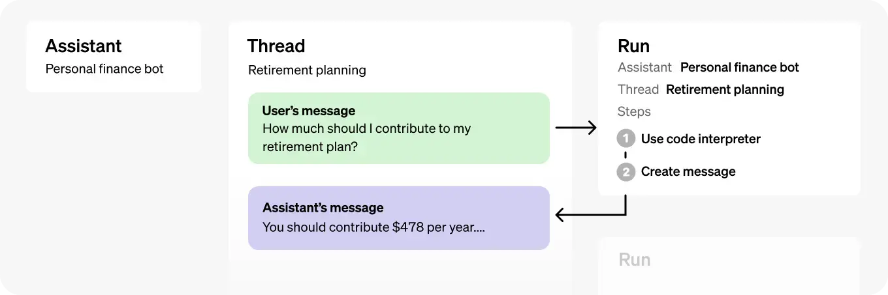
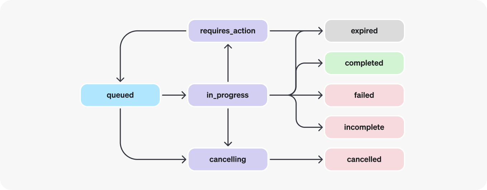

## NEST GPT BACKEND

Proyecto hecho en 
[Nest](https://github.com/nestjs/nest).
como parte de curso del maestro Fernando Herrera
https://www.udemy.com/course/angular-nest-openai/
EXCELENTE!

## Flujo del assistant



## flujo del run



## Previous packages added

```bash
$ npm install class-validator class-transformer
```

```bash
$ npm install @nestjs/config
```

```bash
$ npm install --save openai
```

```bash
$ npm install sharp
```

```bash
$ npm install body-parser
```

## Installation

1. Clone repo
2. Install dependecies
```bash
$ npm install
```
3. Create .env file based on environment variables shown in .env.template
4. Run the app

```bash
# development
$ npm run start

# watch mode
$ npm run start:dev

# production mode
$ npm run start:prod
```

## Test

```bash
# unit tests
$ npm run test

# e2e tests
$ npm run test:e2e

# test coverage
$ npm run test:cov
```

## Links informativos 

- https://platform.openai.com/docs/assistants/overview
- https://platform.openai.com/docs/assistants/how-it-works/managing-threads-and-messages
Crear aqui tu asistente (requiere autorizarte con tu propia cuenta)
- https://platform.openai.com/assistants
Ejemplo de condiciones generales
- https://gist.github.com/Klerith/9d60cde979b811dd780d2da1bfff3900

Para este proyecto se creó un asistente a partir de los términos y condiciones en
- https://www.coppel.com/terminos-y-condiciones


## Support

Nest is an MIT-licensed open source project. It can grow thanks to the sponsors and support by the amazing backers. If you'd like to join them, please [read more here](https://docs.nestjs.com/support).

## Stay in touch

- Author - [Kamil Myśliwiec](https://kamilmysliwiec.com)
- Website - [https://nestjs.com](https://nestjs.com/)
- Twitter - [@nestframework](https://twitter.com/nestframework)
- https://platform.openai.com/docs/overview

## License

Nest is [MIT licensed](LICENSE).
